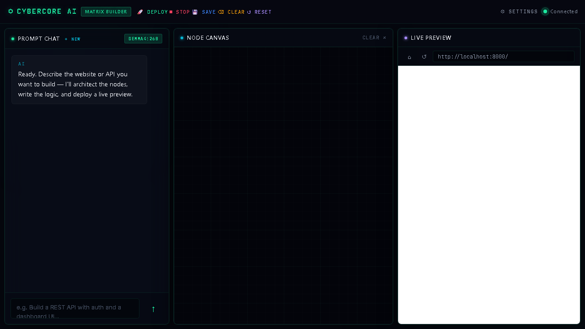

# WebNode Framework (v1.4.1)

A custom, powerful, lightweight node-based web framework for Python. Built around a "Graph of Nodes" architecture, it envisions web request processing as a flowchart of connected nodes.

Instead of traditional decorators (like Flask or Django `@app.route`), WebNode gives you absolute control over the request lifecycle by wiring nodes together—either programmatically in Python, visually via the **built-in drag-and-drop Node Editor GUI**, or via the new **AI Editor**.

**🔥 What's New in v1.3.0 (The "AI & Visual Development" Update):**
*   **AI Editor**: A revolutionary new AI backend integrated directly into your workspace. Chat with the AI agent to automatically generate nodes, CSS, HTML, logic components, and UI interfaces on the canvas.
*   **Enhanced Visual Node Editor**: Improved `graph.json` state restoration via IDE transcript logs to auto-fix corrupt canvas settings.
*   **Full Modular Architecture**: Built-in architecture with dedicated `nodes/`, `core/`, `plugins/`, `static/`, and `templates/` directories automatically scaffolded for you.
*   **Robust Thread-Safe SQLite**: The `core.db` module provides true multi-threaded SQL connection isolation, retry mechanisms, and Write-Ahead Logging (WAL) for heavy concurrency.
*   **WSGI Support**: Ready for production deployment! Run `wsgi.py` via Gunicorn or uWSGI instead of the dev server.
*   **Advanced Middleware & Plugins**: Implement features quickly via `nodes/middleware/`. Pre-built plugins include Rate Limiting, CSRF Verification, Anti-Bot measures, and Action Logging.
*   **Upgraded Responses**: Use `Response` or `StreamingResponse` objects for immediate HTTP control (including Server-Sent Events / SSE for live streaming).
*   **Template Engine**: Includes a powerful Jinja-like template engine supporting ``, ``, and loops/conditionals.
*   **Automated Project Setup**: The CLI `node-web startproject` perfectly templates out a full app, and `setup_project.py` initializes DBs, secret keys, and logs.
*   **Cookies & Sessions**: Built-in, secure, cookie-based sessions via `core/sessions.py` handling `HttpOnly` and `SameSite` natively.

  

---

## 📦 Installation

### From GitHub Repository
```bash
pip install git+https://github.com/LifelessA/webnode.git
```

---

## 🚀 Getting Started

### 1. Create a Project
Use the CLI command to generate a new project structure:

```bash
# If your Python Scripts folder is in PATH:
node-web startproject my_website

# Alternative (If 'node-web' command is not found):
python -m webnode.cli startproject my_website
```

### 2. Initialize the Database and Keys
Navigate to your project and run the setup script once:

```bash
cd my_website
python setup_project.py
```
*(This generates your `.secret_key`, sets up `core/logs/`, and initializes `db.sqlite3` with Write-Ahead Logging)*

### 3. Run the Server (Development)
```bash
python main.py
```
Visit `http://localhost:8000` in your browser.

### 4. Run the Server (Production)
For production environments, WebNode v1.3.0 is fully WSGI compliant. Don't run `main.py` directly; use Gunicorn.
```bash
# Requires gunicorn (Linux/Mac)
pip install gunicorn
gunicorn wsgi:application --workers 4 --bind 0.0.0.0:8000
```

---

## ⚡ Visual Node Editor & AI Editor (Built-in Web IDE)

WebNode includes two distinct browser-based editing interfaces:

### The Node Editor
An amazing GUI for visually constructing your routes and logic without writing the connection code manually!

**How to run it:**
```bash
python node_editor/node_backend.py
```
Open your browser at **http://localhost:8080**.


**Features:**
*   **Drag & Drop**: Drag URL routers, Logic nodes, Python compilers, and HTML renderers from the sidebar Library panel onto a canvas.
*   **Connect Nodes**: Draw connection lines between nodes (`▶` to `●`) to dictate data flow.
*   **Inline Code Editor**: The `LogicNode` and `ContextNode` have an embedded Monaco Code Editor (like VS Code). You can write Python logic directly inside the browser.
*   **Deploy**: Click **"Deploy & Run"** to compile your visual graph instantly into raw `main.py` connecting code and auto-start the backend HTTP Server!
*   **CSS Editor**: Manage your CSS directly using the `CSSNode`.
*   **Live Visual Flow**: Nodes glow 🟢 green when the server is live and connected, 🔴 red when offline.

### The AI Editor
A next-generation AI assistant interface that can build your nodes automatically via natural language queries!

**How to run it:**
```bash
python ai_editor/ai_backend.py
```
Open your browser at **http://localhost:8081**.



**Features:**
*   **Natural Language to Graph**: Tell the AI to "Build a login page" and watch as it spawns a URLNode, LogicNode (with Python code), and RenderNode (with HTML) and auto-connects them.
*   **Seamless Integration**: The AI Editor reads your current `graph.json` and updates it intelligently.

---

## 🧠 Core Concepts: The Graph of Nodes

WebNode is fundamentally different from Flask or Django.
The Request Flow looks like this:
`Server` ➔ `Middleware` ➔ `Request Parser` ➔ `Router` ➔ `[Your Custom Chain]` ➔ `Response`

Every component is a **Node**. You connect them together like a chain:

```python
# The "Technique": Chaining Nodes
url_home.connect(logic_home).connect(render_home)
```

Data flows through this chain. Each node receives the `request` object, processes it, and passes it to the next node. 
> 💡 **Short-Circuiting**: If any node returns a `Response` object instead of a `dict`, the chain stops, and the Response is sent directly back to the browser!

---

## 🤖 MANUAL CODING GUIDE

To build a feature manually in WebNode, you must follow the **Node Chain** methodology.
A standard page consists of: `URLNode` ➔ `LogicNode` ➔ `RenderNode`.

### Step 1: Write Python Business Logic (in `static/my_logic.py`)
Logic functions take a `request` wrapper object. They NEVER handle HTTP protocol directly. They return either:
1. A **Dictionary** (passed to the HTML Template Engine as variables).
2. A **Response** object (to immediately abort the graph and return JSON/Redirects).

```python
# static/profile_logic.py
from core.db import Database
from nodes.response import Response
from core.sessions import get_session_id

db = Database() # Thread-safe SQLite singleton

def profile_logic(request):
    # 1. Get URL parameters (e.g., from /profile/<user_id>)
    user_id = request.url_params.get('user_id')
    
    # 2. Get Query parameters (e.g., from ?tab=settings)
    tab = request.query_params.get('tab', 'overview')
    
    # 3. Get POST Form data
    if request.method == 'POST':
        new_name = request.get_param('name')
        db.execute("UPDATE users SET name=? WHERE id=?", (new_name, user_id))
        return Response.redirect(f'/profile/{user_id}?success=1') # Short-circuits the graph
    
    # 4. Fetch Data
    user_data = db.fetchall("SELECT * FROM users WHERE id=?", (user_id,))
    if not user_data:
        return Response.not_found("User does not exist")
        
    # 5. Return dict to the HTML template
    # Sessions are easy:
    sid = get_session_id(request)
    return {
        'user': user_data[0],
        'current_tab': tab,
        'csrf_token': request.context.get('csrf_token', '') # Provided by CSRFMiddleware
    }
```

### Step 2: Create the HTML Template (in `templates/profile.html`)
WebNode includes a custom rendering engine. Use `{{ variables }}`, ``, ``, and ``.

### Step 3: Wire the Nodes in `main.py`
In `main.py`, you tie the URL, Logic, and Template together in a chain, then add it to the Router.

```python
# main.py
from nodes.server_node import ServerNode
from nodes.http_requests_node import HTTPRequestsNode
from nodes.url_node import URLNode
from nodes.logic_node import LogicNode
from nodes.template_node import RenderNode
from nodes.route_node import RouterNode

from static.profile_logic import profile_logic

# 1. Instantiate Core Nodes
server = ServerNode(host='127.0.0.1', port=8000)
http_parser = HTTPRequestsNode()

# 2. Instantiate Your Branch Nodes
# URLNode handles dynamic segments using <variable_name>
url_profile = URLNode('/profile/<user_id>')
logic_profile = LogicNode(profile_logic)
render_profile = RenderNode('profile.html')

# 3. Connect the Chain together! 
# Flow: If URL matches -> Run Logic -> Render HTML
url_profile.connect(logic_profile).connect(render_profile)

# 4. Add the branch to the Router
router = RouterNode([url_profile])

# 5. Connect the core pipeline
server.connect(http_parser).connect(router)

# 6. Start the Server Wrapper (Boilerplate)
from nodes.server_node import FrameworkHandler
FrameworkHandler.server_node = server
from http.server import HTTPServer
from socketserver import ThreadingMixIn

class ThreadedHTTPServer(ThreadingMixIn, HTTPServer): pass

with ThreadedHTTPServer((server.host, server.port), FrameworkHandler) as httpd:
    httpd.serve_forever()
```

---

## 🛠️ Framework Features Cheat Sheet

### 1. Returning JSON APIs
Instead of a template, return `Response.json()` from your `LogicNode`:
```python
from nodes.response import Response
def my_api(request):
    return Response.json({"status": "success", "items": [1, 2, 3]})
```

### 2. Live Streaming / SSE (Server-Sent Events)
WebNode natively supports SSE via Python Generators! No JavaScript websockets required.

```python
import time
from nodes.response import StreamingResponse

def live_clock(request):
    def generator():
        while True:
            yield f"<span style='color:red'>{time.time()}</span>"
            time.sleep(1)
            
    # The browser will render this HTML dynamically and infinitely!
    return {"stream": StreamingResponse(generator())}
```
*In HTML:* Output the stream using `{{ stream | safe }}`.

### 3. Server-Side Sessions
Cookie-based, highly secure, in-memory sessions are baked into `core.sessions`.
```python
from core.sessions import get_session_id, get_session_data, set_session_data

def cart_logic(request):
    sid = get_session_id(request) # Auto-creates cookie if missing
    set_session_data(sid, 'account_type', 'premium')
```

### 4. Form Validation
`core.validators` sanitizes variables easily.
```python
from core.validators import validate_form

def process(request):
    rules = {
        'age': {'type': 'int', 'min': 18, 'max': 99},
        'email': {'type': 'email', 'required': True}
    }
    cleaned_data, errors = validate_form(request, rules)
    if errors:
        return {'error_message': ", ".join(errors)}
```

---

## 📚 Core Nodes Dictionary

*   **ServerNode** (`nodes.server_node`): Initiates the HTTP server.
*   **HTTPRequestsNode** (`nodes.http_requests_node`): Parses WSGI/bytes into `request`. Exposes `get_param()`, `get_file()`, etc.
*   **Logical Nodes**:
    *   **LogicNode** (`nodes.logic_node`): Runs standard Python code.
    *   **ContextNode** (`nodes.context_node`): Injects global variables.
*   **Routing Nodes**:
    *   **RouterNode** (`nodes.route_node`): Splits flow into multiple branches. Matches first successful.
    *   **URLNode** (`nodes.url_node`): Checks path and method. Extracts `<vars>`.
*   **Render Nodes**:
    *   **RenderNode** (`nodes.template_node`): Renders Jinja-style HTML.
    *   **CSSNode** (`nodes.css_node`): Compiles raw CSS strings.
    *   **JSNode** (`nodes.client_js_node`): Injects Client-side JS functionality.
*   **Database**:
    *   **ModelNode** (`nodes.model_node`): Visual alternative for SQL queries.
*   **Security & Plugins** (In `plugins/`, tied via `settings.py`):
    *   **RateLimitNode**: Mitigates spam by IP.
    *   **CSRFNode**: Verifies POST tokens.
    *   **AntiBotNode**: Blocks unverified scrapers via User-Agent.
    *   **ActionLoggerNode**: Rotates logs to `core/logs/`.
